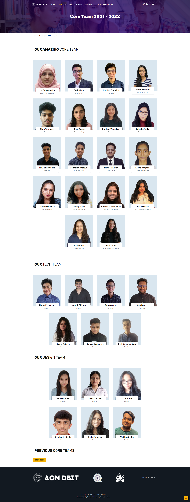

# ACM DBIT


## Table of contents

- [Overview](#overview)
- [Screenshots](#screenshots)
- [Getting Started](#gettingstarted)
- [Contributors](#contributors)

## Overview

#### ACM DBIT - Dept. of Computer Engineering

Learn from the best mentors. Get certified in the latest technologies. We understand the students needs and find the best suited training and workshops required and help the students polish their skillsets to guarantee an excellent career ahead.
- Our Philosophy
    - Creates opportunities for Innovation.
- Our Motto
    - Advancing Computing as a Science & Profession
- Key Of Success
    - We have a clear vision and are able to articulate the path forward to the team.
- Our Team
    - Diversity in skills with effective communication.
                        
                        


### Screenshots
 <br>
   


## Getting Started  <a id="gettingstarted"></a>

#### Step 1:

Download or clone this repository by using the command given below:

```
git clone https://github.com/flockflair-dbit/acm-website
```

#### Step 2:

Go to project root and open the index.html file in the browser


## Contributors <a id="contributors"></a>
  - Grejo Joby<br> 
  [](https://www.linkedin.com/in/grejojoby)
  [](https://github.com/grejojoby)
  - Hayden Cordeiro<br>
  [](https://www.linkedin.com/in/haydencordeiro/)
  [](https://github.com/haydencordeiro)


